# Weather Forecast Microservices Application

```mermaid
graph TD
    A["🌐 Frontend-GUI(8080)<br>[Java/Spring]"] -->|HTTP| B["⚙️ Backend-API(8081)<br>[Java/Spring]"]
    A -->|HTTP| C["📄 Backend-CSV(8082)<br>[Java/Spring]"]
    A -->|HTTP| D["📊 Backend-Graph(8083)<br>[Python/Django]"]
    A -->|HTTP| E["💾 Backend-DB(8084)<br>[Python/Django]"]
    A -->|HTTP| F["📤 Backend-Exporter(8085)<br>[Node.js]"]
    B -->|API Call| G["☁️ Open-Meteo API"]
    style A fill:#1976D2,color:white
    style B fill:#4CAF50,color:white
    style C fill:#FF9800,color:white
    style D fill:#9C27B0,color:white
    style E fill:#607D8B,color:white
    style F fill:#2196F3,color:white
```

## Project Overview

This cloud-native application delivers comprehensive 7-day weather forecasts using a robust microservices architecture. Designed for flexibility and scalability, it enables users to access, visualize, and export weather data seamlessly via both web interface and API endpoints.

Each microservice is responsible for a specific function—ranging from data retrieval and caching, to visualization, storage, and export—ensuring modularity and ease of maintenance. The system integrates with the Open-Meteo API for real-time weather data, supports persistent storage for historical analysis, and provides interactive charts for trend exploration. With containerized deployment, the application is easy to set up locally or in the cloud, making it suitable for both development and production environments. Whether you are a developer, analyst, or end-user, this platform offers a reliable and extensible solution for weather insights.

Built with modern technologies such as Spring Boot, Django, and Node.js, the application emphasizes clean separation of concerns and efficient communication between services. Its intuitive frontend allows users to input coordinates and instantly receive detailed forecasts, while backend services handle data processing, storage, and export operations. The architecture supports future enhancements, making it straightforward to add new features or integrate additional data sources as requirements evolve.

**Highlights:**

- 🌦 **Live Weather Data:** Retrieves up-to-date forecasts from the Open-Meteo API.
- 🚀 **Optimized Performance:** Implements intelligent caching to reduce latency and API calls.
- 📊 **Rich Visualization:** Presents interactive temperature trend graphs for deeper insights.
- 💾 **Persistent Storage:** Saves weather data for future reference and analysis.
- 📤 **Flexible Export:** Supports exporting data in multiple formats, including CSV and Excel.
- 🐳 **Easy Deployment:** Fully containerized for streamlined setup with Docker.

Ideal for developers, analysts, and end-users seeking reliable, extensible weather insights.
<div style="page-break-after: always;"></div>

## System Architecture
### API Call Flow


### Microservices Details

| Service         | Port | Technology           | Functionality                              |
|-----------------|------|---------------------|--------------------------------------------|
| frontend-gui    | 8080 | Spring Boot + Thymeleaf | Web interface with form inputs and data display |
| backend-api     | 8081 | Spring Boot         | Weather data fetching with caching         |
| backend-csv     | 8082 | Spring Boot         | CSV file generation and storage            |
| backend-graph   | 8083 | Python/Django       | Temperature trend visualization            |
| backend-db      | 8084 | Python/Django       | Data persistence with SQLite               |
| backend-exporter| 8085 | Node.js             | Multi-format data export (CSV/Excel)       |
<div style="page-break-after: always;"></div>

### Service Endpoints Details

| Service           | Port | Endpoint              | Method | Description             | Parameters / Request Body         |
|-------------------|------|----------------------|--------|-------------------------|-----------------------------------|
| Frontend-GUI      | 8080 | `/`                  | GET    | Weather form page       | -                                 |
| Frontend-GUI      | 8080 | `/`                  | POST   | Fetch weather data      | `latitude`, `longitude`           |
| Backend-API       | 8081 | `/api/weather`       | GET    | Get forecast            | `lat`, `lon`                      |
| Backend-CSV       | 8082 | `/api/csv/save`      | POST   | Save to CSV             | JSON weather data                 |
| Backend-Graph     | 8083 | `/api/graph/plot`    | POST   | Generate graph          | JSON weather data                 |
| Backend-DB        | 8084 | `/api/db/save`       | POST   | Save to database        | JSON weather data                 |
| Backend-DB        | 8084 | `/api/db/get`        | GET    | Retrieve records        | -                                 |
| Backend-Exporter  | 8085 | `/api/export/csv`    | POST   | Download CSV            | JSON weather data                 |
| Backend-Exporter  | 8085 | `/api/export/excel`  | POST   | Download Excel          | JSON weather data                 |
---
### Endpoint Parameters Explained

- **latitude, longitude:** Geographic coordinates (in decimal degrees) specifying the target location for weather data retrieval.
- **lat, lon:** Alternative parameter names for latitude and longitude, commonly used in API query strings.
- **JSON weather data:** Structured weather information sent as JSON, typically including fields like `fetchTime`, `latitude`, `longitude`, `date`, `maxTemp`, and `minTemp`. Used for saving, exporting, or visualizing weather records.
- **No parameters (`-`):** Indicates the endpoint does not require any input parameters or request body.
- **Method:** The HTTP method (`GET` or `POST`) required to interact with the endpoint.

These parameters standardize data exchange between microservices and clients, ensuring accurate weather data processing, storage, and export.
<div style="page-break-after: always;"></div>

### Sample CURL Commands
**1. Fetch Weather Data**
```bash
curl "http://localhost:8081/api/weather?lat=19.1116&lon=73.0094"
```

**2. Save to CSV Service**
```bash
curl -X POST http://localhost:8082/api/csv/save \
    -H "Content-Type: application/json" \
    -d '[{"fetchTime":"2025-05-10 10:00:00","latitude":"19.1116","longitude":"73.0094","date":"2025-05-10","maxTemp":32.5,"minTemp":24.8}]'
```

**3. Generate Temperature Graph**
```bash
curl -X POST http://localhost:8083/api/graph/plot \
    -H "Content-Type: application/json" \
    -d '[{"date":"2025-05-10","maxTemp":32.5,"minTemp":24.8},{"date":"2025-05-11","maxTemp":33.1,"minTemp":25.2}]'
```

**4. Store in Database**
```bash
curl -X POST http://localhost:8084/api/db/save \
    -H "Content-Type: application/json" \
    -d '[{"fetchTime":"2025-05-10 10:00:00","latitude":"19.1116","longitude":"73.0094","date":"2025-05-10","maxTemp":32.5,"minTemp":24.8}]'
```

**5. Export Excel File**
```bash
curl -X POST http://localhost:8085/api/export/excel \
    -H "Content-Type: application/json" \
    -d '[{"fetchTime":"2025-05-10 10:00:00","latitude":"19.1116","longitude":"73.0094","date":"2025-05-10","maxTemp":32.5,"minTemp":24.8}]' \
    --output weather_data.xlsx
```
<div style="page-break-after: always;"></div>

### Installation & Deployment Guide

This section provides step-by-step instructions for setting up and running the Weather Forecast Microservices Application, both for local development and containerized environments.

#### 1. Local Development

##### Prerequisites

Ensure the following tools are installed on your system:

- **Java 17+** (for Spring Boot services)
- **Maven 3.6+** (for building Java projects)
- **Python 3.9+** (for Django-based services)
- **Node.js 18+** (for the exporter service)
- **Docker 20+** (for containerized deployment, optional but recommended)

##### Deployment 
```bash
# Clone repository
git clone https://github.com/Dhrobajoti/weather-forecast-application.git
cd weather-forecast-application

# Build all services
mvn clean install -f frontend-gui/pom.xml
mvn clean install -f backend-api/pom.xml
mvn clean install -f backend-csv/pom.xml

# Run services
java -jar frontend-gui/target/*.jar
java -jar backend-api/target/*.jar
# ...repeat for other Java services

# For Python services
python manage.py runserver 8083
python manage.py runserver 8084

# For Node.js service
cd backend-exporter
npm install
npm start
```

##### Accessing the Application

- **Frontend GUI:** [http://localhost:8080](http://localhost:8080)
- **API Endpoints:** See the "Service Endpoints Details" section above for all available endpoints and ports.
---

<div style="page-break-after: always;"></div>

#### 2. Docker Deployment

For a streamlined setup, use Docker Compose to build and run all services as containers.

```bash
# Build and start all services in detached mode
docker-compose up --build -d

# View running containers
docker ps
```

##### Accessing the Application

- **Frontend GUI:** [http://localhost:8080](http://localhost:8080)
- **API Endpoints:** See the "Service Endpoints Details" section above for all available endpoints and ports.
---

- All services will be accessible on their respective ports as defined in the architecture section.
- Logs for each service can be viewed using `docker-compose logs <service-name>`.

> **Tip:** If you make code changes, re-run `docker-compose up --build -d` to rebuild the affected services.

---

#### Troubleshooting

- Ensure all required ports (8080–8085) are free before starting services.
- If you encounter dependency issues, verify your tool versions and re-install dependencies as needed.
- For database migrations, always run `python manage.py migrate` in the Python service directories.

---

For further customization, environment variables and configuration files can be adjusted in each service directory as needed.
